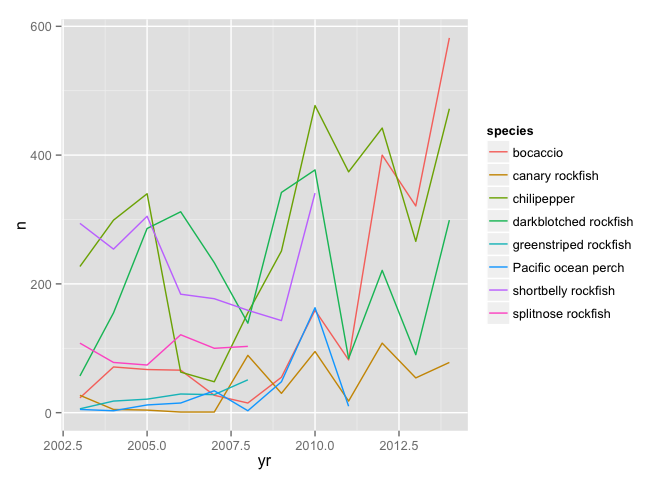
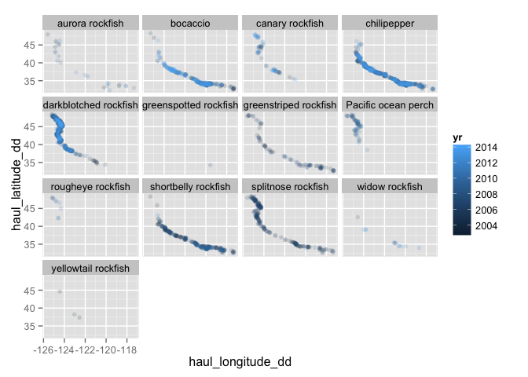

    source("0-read.R")

    library("ggplot2")
    library("dplyr")
    filter(ind, age_yrs <= 2) %>%
      group_by(scientific_name, species, yr) %>%
      summarise(n = n()) %>%
      filter(max(n) > 50) %>%
      ggplot(aes(yr, n, colour = species)) + geom_line()

    d <- ind %>%
      filter(age_yrs <= 2) %>%
      group_by(scientific_name, species, yr, haul_latitude_dd, haul_longitude_dd) %>%
      summarise(n = n()) %>%
      as.data.frame()

    ggplot(d, aes(haul_longitude_dd, haul_latitude_dd, colour = yr)) + 
      geom_point(alpha = 0.15) + facet_wrap(~species)

